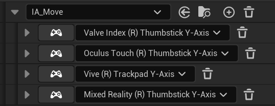
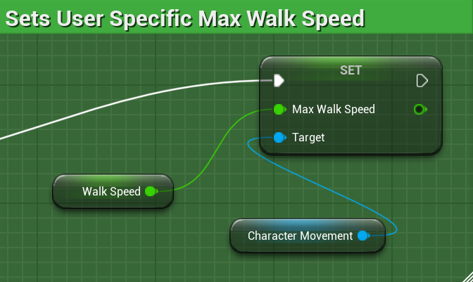
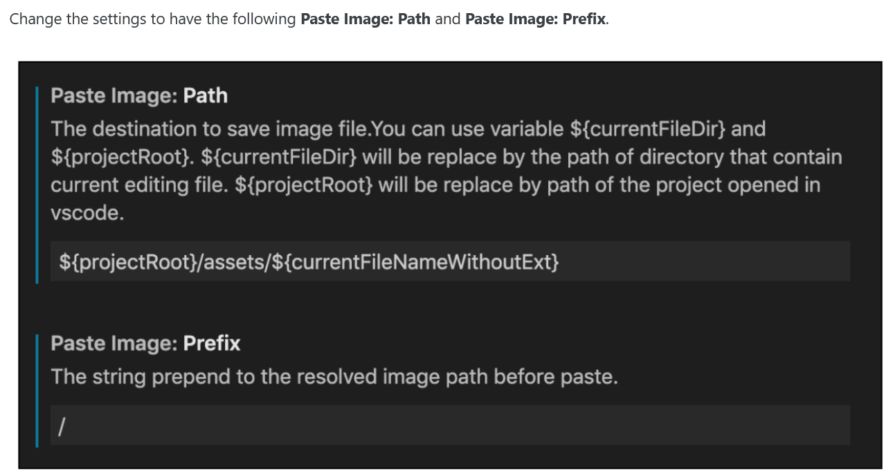

# Introduction to Digital Media - VR Project

This repository is for VR project of Introduction to Digital Media course from University of Bremen. 

The challenges are as below:

1. Setting up a scene in the Unreal Engine that works in VR
2. Modifying the initial VR scene by adding a few assets to make it look better
3. Implementing a locomotion metaphor other than teleporting

You will find guides and tutorials for the Unreal engine e.g. in the Links section of the VR course: https://cgvr.informatik.uni-bremen.de/teaching/vr/

# Video Demonstration

(via YouTube, click the image to open the link)

# Changelog
## IMC_Default

Deleted old movement part:

New IA_SnapTurn:

Updated IMC_Default:

## VR_Pawn Blueprint

**Set the Positon Rotation and Height of the Player Capsule**

**Primary Inputs for Thumbstick Locomotion**

**NEW Event Tick to Update Capsule Height of VR Pawn**

**Sets User Specific Max Walk Speed**

## Collision Preset

Added new collision preset to prevent `grabable object` messing up the collision with our VR Pawn

And then change all Collision Presets for these two objects: `SmallCube` and `Pistol` to new preset `InteractableObject`

For `Projectile`, make it custom, where `InteractableObject` became `Overlap`

# References:

- https://www.youtube.com/watch?v=KTPx8PeKyQM

# Misc

- Using `Paste Image` extension in VSCode ([source](https://www.janmeppe.com/blog/paste-image/))

