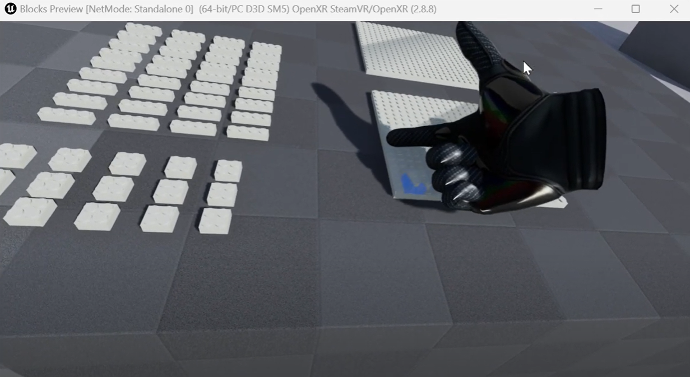

# Virtual Reality and Physically-Based-Simulation Winter Semester 2024/2025
Repository for homework project of this VR course from University of Bremen, Germany.

Homepage: https://cgvr.cs.uni-bremen.de/teaching/vr/

## Assignment 4

Team members:

- Enlik Enlik
- Vanshika Chaudhary
- Jayon K. Vinod

**Folder for Assignment 04: (different branch)**

https://github.com/enliktjioe/vr2024/tree/vr_jayon_assignment_4/jkv-4/Blocks

**Video Demonstration:**

https://youtu.be/xiaR4d8HGAo

**C++ scripts: (Added Ghost Mesh for object highlighting)**

- https://github.com/enliktjioe/vr2024/blob/vr_jayon_assignment_4/jkv-4/Blocks/Source/Blocks/Base/BlockBaseActor.cpp
- https://github.com/enliktjioe/vr2024/blob/vr_jayon_assignment_4/jkv-4/Blocks/Source/Blocks/Base/BlockBaseActor.h

- https://github.com/enliktjioe/vr2024/blob/vr_jayon_assignment_4/jkv-4/Blocks/Source/Blocks/Blocks/Block1x4Actor.h
- https://github.com/enliktjioe/vr2024/blob/vr_jayon_assignment_4/jkv-4/Blocks/Source/Blocks/Blocks/Block2x2Actor.h

**Project zip file: (using UE v5.3.2)**

https://drive.google.com/file/d/1xHE_n9rZPIStIpkFCaMEKP9cOYAEAuYK/view?usp=drive_link

## Assignment 3

Team members:

- Enlik Enlik
- Vanshika Chaudhary
- Jayon K. Vinod

Project Folder (different branch): [/assignment_03/VR_cpp_LOD](https://github.com/enliktjioe/vr2024/tree/vr_enlik_assignment03/assignment_03/VR_cpp_LOD)

C++ scripts:

- https://github.com/enliktjioe/vr2024/blob/vr_enlik_assignment03/assignment_03/VR_cpp_LOD/Source/VR_cpp_LOD/Actor_Assignment03.cpp
- https://github.com/enliktjioe/vr2024/blob/vr_enlik_assignment03/assignment_03/VR_cpp_LOD/Source/VR_cpp_LOD/Actor_Assignment03.h

ZIP project(using UE v5.3.2): [via google drive](https://drive.google.com/file/d/1abGC71QI8izwHMUsNaCK1V7ezDF6RJnd/view?usp=sharing)

Video Demonstration: (via YouTube, click the image to open the link)

## Assignment 2

Team members:

- Enlik Enlik
- Vanshika Chaudhary

Folder: [/materials_vr](https://github.com/enliktjioe/vr2024/tree/master/materials_vr)

Video Demonstration: (via YouTube, click the image to open the link)

## Assignment 1

Team members:

- Enlik Enlik
- Sri Roopesh Grandhi
- Vanshika Chaudhary

Project Folder: [/HelloUnreal](https://github.com/enliktjioe/vr2024/tree/master/HelloUnreal)

Video Demonstration: (via YouTube, click the image to open the link)

